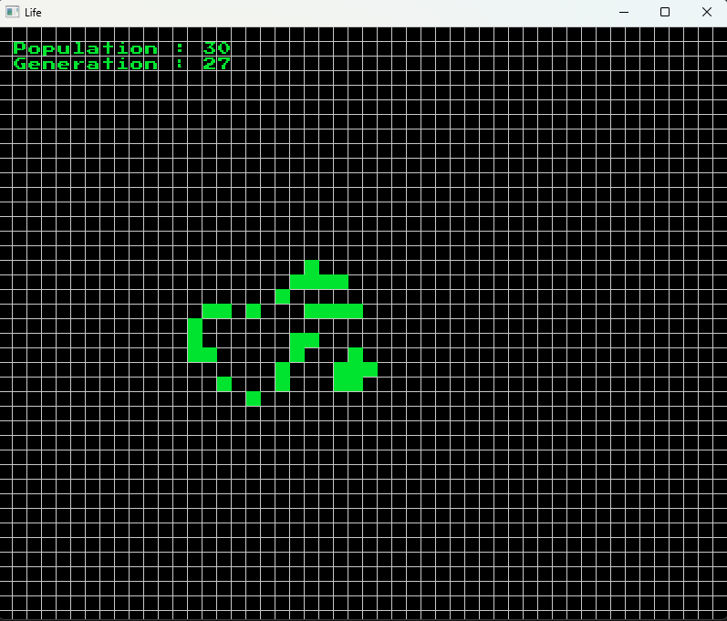

# Game_of_life_C
This program is a C implementation of **Game of Life**, using **raylib** to build the GUI.
The main window looks like this:



You can interact with the GUI using the mouse and keyboard:  
- **Space** to pause/resume  
- **Left mouse click** to draw cells  
- **Right mouse click** to pan the view  
- **Mouse wheel** to zoom in and out
- **+** or **-** to adjust the speed

## Implementation
Under the hood, the implementation uses an hashtable build with uthash.h. 
the world is dynamic, so the hashtable is used to maintain active chunks (the ones with cells) and remove the others.
The `World` is a struct that includes 2 chunktables (one current and one for building the next round) and a struct `GameSettings` to maintain the game options like the speed.
The hashtable is linked to the view through the `GridView` struct.

## Build
The build system uses **CMake**, which downloads automatically **raylib** with FetchContent.
You can build the program using the usual cmake instruction:
Linux:
```
mkdir build
cmake -S . -B build
cd build
make
Optional: (sudo) make install
```
Windows:
```
mkdir build
cmake -S . -B build
cmake --build build
Optional: cmake --install build
```

The program has been tested on **WSL Ubuntu (gcc 13.3.0)** and on **Windows 11 with visual studio 22 (MSVC 19.44.35207.1)**.
If the program has some linking problem on visual studio (only x64-Release) try to delete the out/ (or build/) directory and restart cmake.